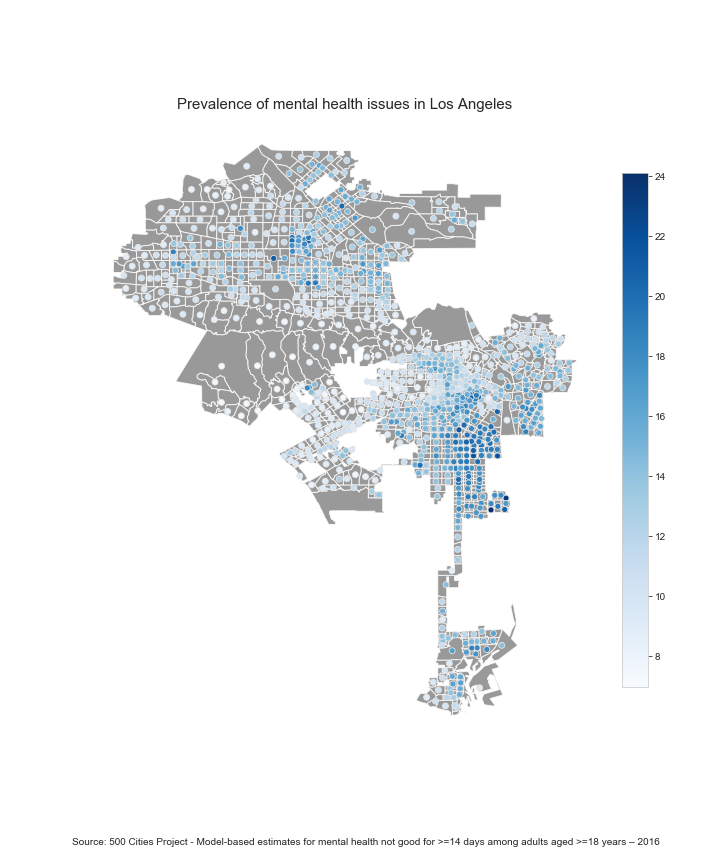
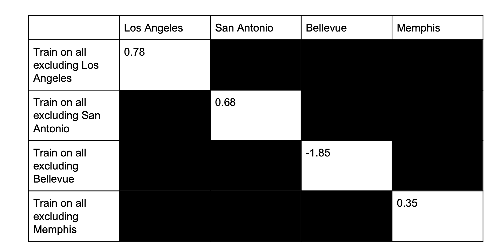

# Deep Learning for Mental Health

This repo is based on another paper: https://github.com/adymaharana/ObesityDL

This is a project for the class: CSCI499 Artificial Intelligence for Social Good
> Link to paper: [paper](CSCI499_Fall2019_ProjectReport_Chen_ChiSan.pdf)

## Abstract

In this paper, we adopt a novel method for the task of predicting the prevalence of mental health issues in a city. By utilizing socioeconomic data, as well as built environmental features derived from satellite imagery, to predict the prevalence of mental health issues in a city, the method provides an alternative to telephone and in-person interviews. Through this method, we demonstrate that built environmental features do correlate with the prevalence of mental health issues. Our multi-modal model achieves a maximum of 0.86 R2 score for Intra-City predictions and a maximum of 0.78 R2 score for Multi-city and Cross-City predictions. Hence, our proposed method demonstrates a reliable, uniform method to predict mental health issues, and could be applied to other cities in the world that are not included in this study.

## Methodology (Simplified)

1. Obtain census tract data per city selected
2. Obtain shapefile per city
3. Obtain socioeconomic features per census tract
4. Obtain images from google static maps api
5. Extract image features per image within census tract
6. Mean all image features within census tract to extract 1 data point
7. Combine socioeconomic features and extracted image features per census tract
8. Regress to predict prevalence of mental health

## Code

| Notebook                     | Function                              |
|------------------------------|---------------------------------------|
| Main.ipynb                   | EDA                                   |
| socioeconomic_features.ipynb | Extract socioeconomic features        |
| Download_imgs.ipynb          | Download and Extract Satellite Images |
| Model_eval.ipynb             | Regression model results              |

## Sample output

*Trained on Memphis, Tested on Los Angeles:*

## Results

*Multi-city performance of Gradient Boosting Regression with Multi-modal features*

